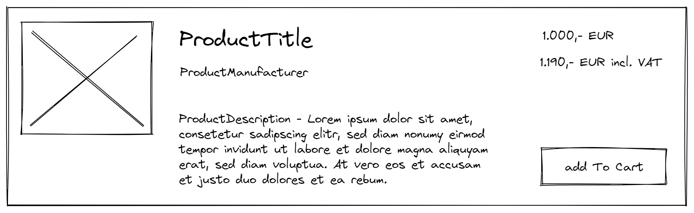

# Assessment exercise: Create a product list

Your task will be to design a product list for a web shop with entries based on a provided sketch and a textual description. A few product data entries to be displayed are part of this seed repository.

The solution should be web-based and runnable in a browser, but you are free in the specific technology and libraries you use in its implementation (Vue, React, Angular, plain JS, etc.).

## Project Setup

The only thing you need to do is installing the `json-server` npm package and running it using the provided `db.json` file, like this:
```bash
npm install json-server -g
json-server --watch db.json
```

Once the server is running, a few example products can be fetched via `http://localhost:3000/products`.

## Requirements

As stated above, you need to create a simple product list view (no paging needed) based on this sketch:


Some more textual specification:
- Get the example product data from the provided json-server endpoint (see setup)
- You can use any free example photo provider service (eg. https://picsum.photos/ or https://placeholder.com/ or others) as a source for product image placeholders. The content of the images is not important for the task. They should simply be part of the layout.
- Every product can be put into the shopping cart once or multiple times. You do not need to build a shopping cart view or list of added items, but you should save the information about items that were added to the cart, because they should later be send to the backend. So please think of a concept for this.
